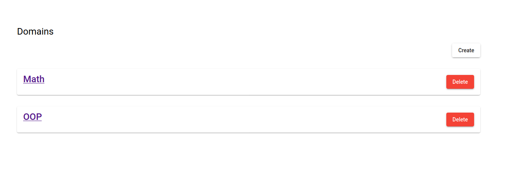
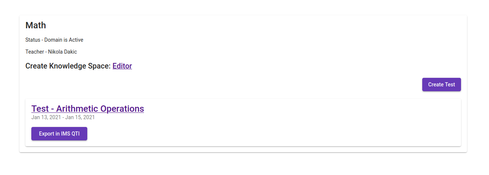
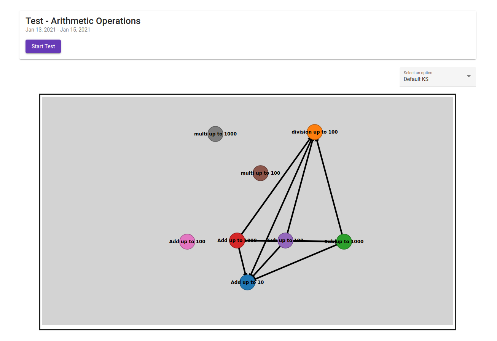
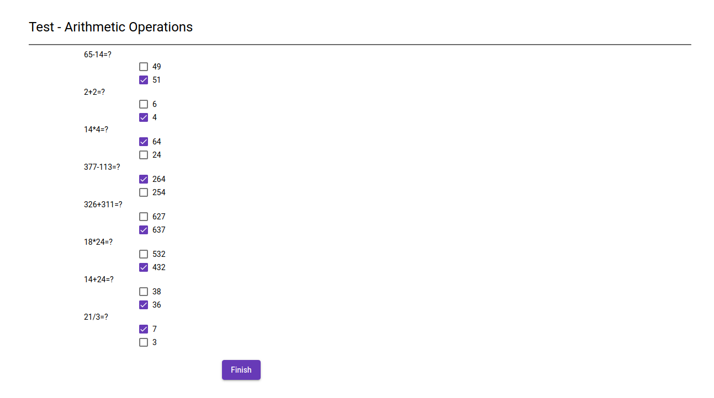
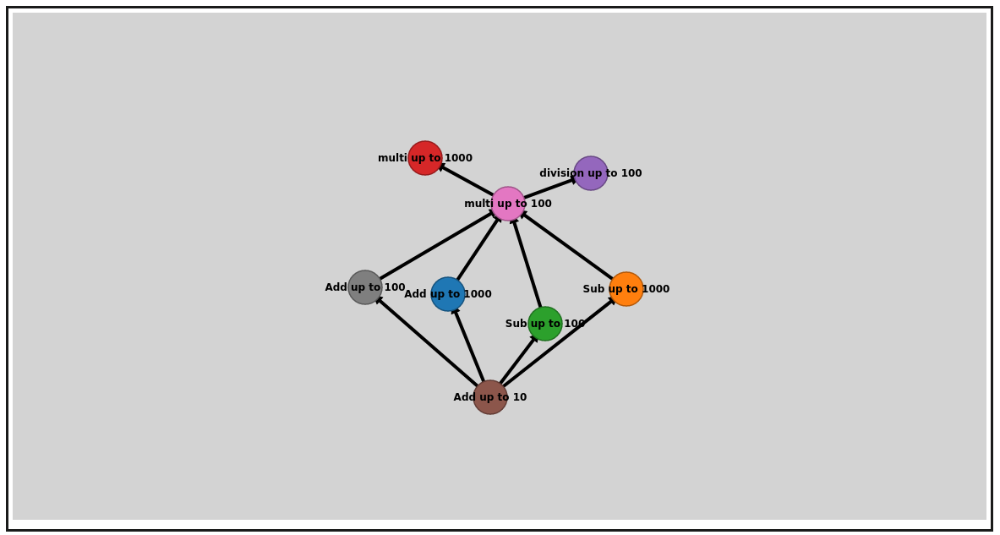
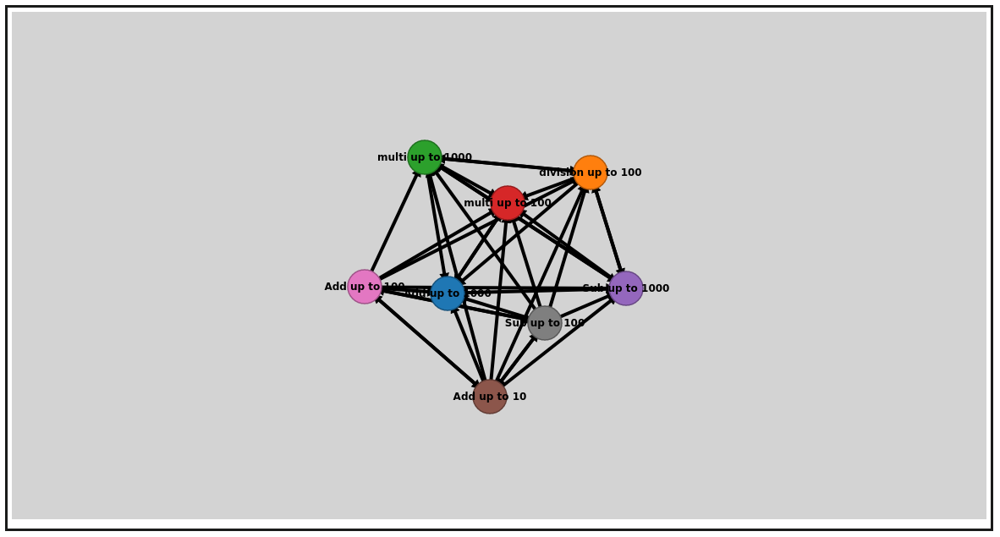
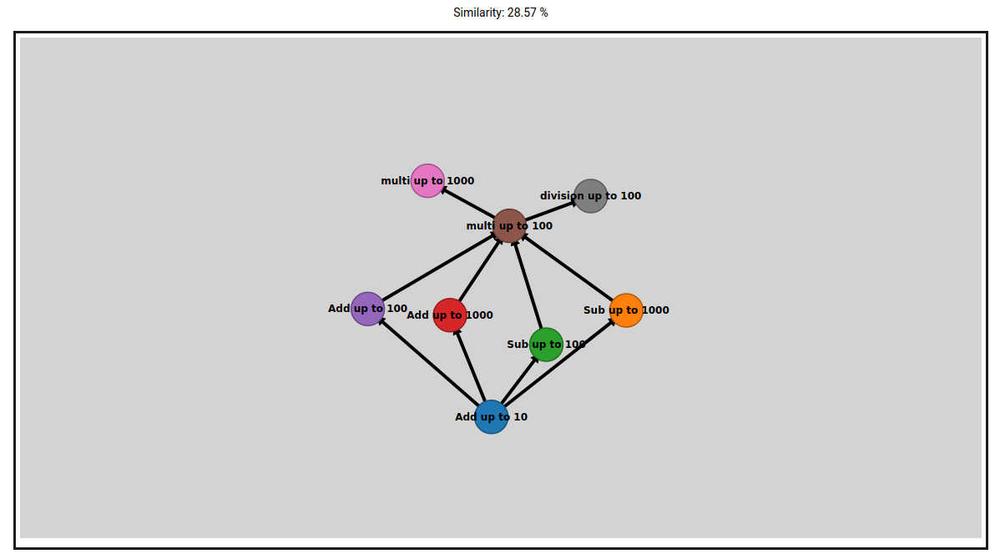

# Modern Educational Technologies and Standards

Course Modern Educational Technologies and Standards at Faculty of Technical Sciences, University of Novi Sad

## Getting started

These instructions will help you to run this project.

### Prerequisites

All applications are dockerized and you only need to install:

 - [docker](https://docs.docker.com/engine/installation/)
 - [docker-compose](https://docs.docker.com/compose/install/)

Make sure following ports are open

- 5432
- 9000
- 4200
- 5000

Supported applications are:

- elearning-postgres
- elearning-server
- elearning-client
- elearning-knowledge-space

## Launch applications

### Run all applications:
    docker-compose up

### Bring up specific service with command:
    docker-compose up [SERVICE_NAME]

### Stop all service:
    docker-compose down

### Bring down specific service with command:
    docker-compose down [SERVICE_NAME]

## Screenshots

Domain List            |  Domain Details
:-------------------------:|:-------------------------:
  |  

Test Details            |  Taking the Test
:-------------------------:|:-------------------------:
 | 

Knowledge Space Editor            |  Real Knowledge Space          |  Teacher's vs Real KS
:-------------------------:|:-------------------------:|:-------------------------:
 |  | 
